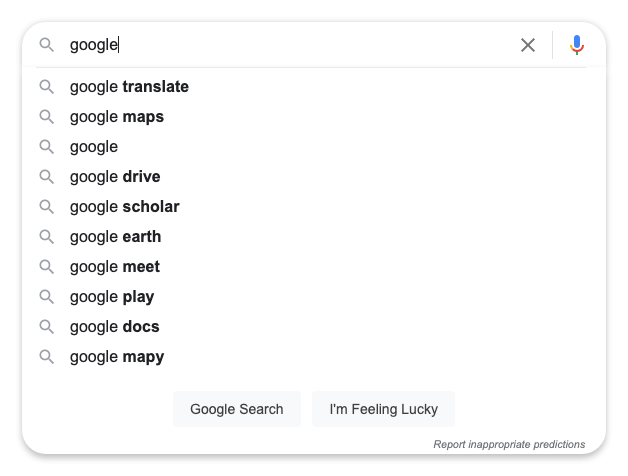

# freevision React Exam project

This project was bootstrapped with [Create React App](https://github.com/facebook/create-react-app).

## Task

Your task is to create a text input with suggestions.

- Read these instruction all the way to the end (including notes)
- Suggestions should be loaded from backend, not filtered on client\
  (use `http://localhost:3001/birds?q=...` for loading the data)
- Suggestions should only be loaded after user typed at least 3 characters
- After user selects one of suggested options, the option ID should be displayed on screen
- Input should have an icon indicating it is search input
- Input should have style to indicate it is focused
- Input should inform user if there are no results found for entered text
- Input should inform user that they have to enter more text
- There should be some tests (what to test and how is up to you)
- You can use any design you want, but suggestions should "attach" to the input. \
  See example below:

Bonus points for:

- Loading indicator while suggestions are being loaded from backend
- Keyboard navigation between suggestions
- Cool design (does not have to be google ;) )

## Notes

- You don't have to make the design work on all browsers, latest versions of any modern browser is fine.
- You can use any number of components or files. You can also remove files included in the project by default.
- You can add additional libraries if you want to, but don't overdo it. UI Library with complete search input is cheating.
- Design is not the top priority (but it is welcomed). Do not throw in shadows, just because you know how to do them. Clean and simple CSS is prefered.
- TypeScript is prefered, but if you don't want to / can't use TypeScript, just rename the files to `.js` and use plain old JavaScript. ES6 is fine.

## Available Scripts

In the project directory, you can run:

### `yarn start`

Runs the app in the development mode.\
Open [http://localhost:3000](http://localhost:3000) to view it in the browser.

The page will reload if you make edits.\
You will also see any lint errors in the console.

### `yarn test`

Launches the test runner in the interactive watch mode.\
See the section about [running tests](https://facebook.github.io/create-react-app/docs/running-tests) for more information.

### `yarn dev-server`

Launches dev server (json-server) for this exam with single endpoint for searching data.\
Open [http://localhost:3001/birds](http://localhost:3001/birds) to view it in browser.\
You will be using its fulltext search functionality by using `?q=` parameter. \
For example: [http://localhost:3001/birds?q=american](http://localhost:3001/birds?q=american)
